# Odys Codebase Architecture

```mermaid
flowchart TB
    subgraph "User Layer"
        User[User Code]
    end

    subgraph "odys Package"

        subgraph "Domain Layer"
            Assets[Assets<br/>- Generator<br/>- Storage<br/>- Load<br/>- Market]
            Portfolio[AssetPortfolio]
            Objective[Objective<br/>- ProfitTerm<br/>- CVaRTerm]
            Scenarios[Scenarios<br/>- Scenario<br/>- StochasticScenario]
            Validation[Validation]
            Exceptions[Exceptions<br/>- OdysError<br/>- OdysValidationError<br/>- OdysSolverError]
        end

        subgraph "EnergySystem (Entry Point)"
            ES[EnergySystem]
            ESParams[build_parameters<br/>→ EnergySystemParameters]
            ESOpt[optimize<br/>→ OptimizationResults]
        end

        subgraph "Optimization Layer"

            subgraph "Parameters"
                GenParams[GeneratorParameters]
                StorParams[StorageParameters]
                LoadParams[LoadParameters]
                MktParams[MarketParameters]
                ScenParams[ScenarioParameters]
                ESParamsAll[EnergySystemParameters]
            end

            subgraph "Model Building"
                Builder[EnergyAlgebraicModelBuilder]

                subgraph "Variables"
                    GenVars[GENERATOR_VARIABLES]
                    StorVars[STORAGE_VARIABLES]
                    MktVars[MARKET_VARIABLES]
                    CVARVars[CVAR_VARIABLES]
                end

                subgraph "Constraints"
                    GenCon[GeneratorConstraints]
                    StorCon[StorageConstraints]
                    MktCon[MarketConstraints]
                    ScenCon[ScenarioConstraints]
                    CVARCon[CVaRConstraints]
                end

                subgraph "Objective"
                    Obj[build_objective]
                end

                MILP[EnergyMILPModel]
            end
        end

        subgraph "Solver Layer"
            Solver[optimize_algebraic_model]
            SolverConfig[SolverConfig]
            HiGHS[HiGHS Solver]
        end

        subgraph "Results Layer"
            Results[OptimizationResults]
            SolvedData[SolvedModelData]
            ResultContainers[Result Containers]
        end
    end

    %% User to EnergySystem
    User --> ES

    %% Domain to EnergySystem
    Assets --> Portfolio
    Portfolio --> ES
    Scenarios --> ES
    Objective --> ES

    %% EnergySystem to Optimization
    ES --> ESParams
    ESParams --> ESParamsAll

    ESParamsAll --> Builder
    Builder --> MILP

    %% Variables to Builder
    GenVars --> Builder
    StorVars --> Builder
    MktVars --> Builder
    CVARVars --> Builder

    %% Constraints to Builder
    GenCon --> Builder
    StorCon --> Builder
    MktCon --> Builder
    ScenCon --> Builder
    CVARCon --> Builder

    %% Objective to Builder
    Obj --> Builder

    %% Parameters to Builder
    GenParams --> ESParamsAll
    StorParams --> ESParamsAll
    LoadParams --> ESParamsAll
    MktParams --> ESParamsAll
    ScenParams --> ESParamsAll
    Objective --> ESParamsAll

    %% Solver
    MILP --> Solver
    SolverConfig --> Solver
    Solver --> HiGHS

    %% Results
    Solver --> Results
    SolvedData --> Results
    ResultContainers --> Results
    Validation -.->|validates| ES
    Exceptions -.->|raises| ES
```

## Data Flow Summary

1. **User** defines assets (Generator, Storage, Load) and creates an **AssetPortfolio**
2. **EnergySystem** receives portfolio + scenarios + markets
3. **build_parameters()** converts to **EnergySystemParameters**
4. **EnergyAlgebraicModelBuilder** builds:
   - Variables (from ModelVariable definitions)
   - Constraints (Generator, Storage, Market, Scenario, CVaR)
   - Objective (Profit or CVaR)
5. **EnergyMILPModel** wraps linopy model
6. **Solver** (HiGHS) solves the MILP
7. **OptimizationResults** returns solution

## Key Dependencies

- **linopy**: Linear/mixed-integer optimization modeling
- **highspy**: HiGHS MILP solver
- **xarray**: N-dimensional arrays
- **pydantic**: Data validation
