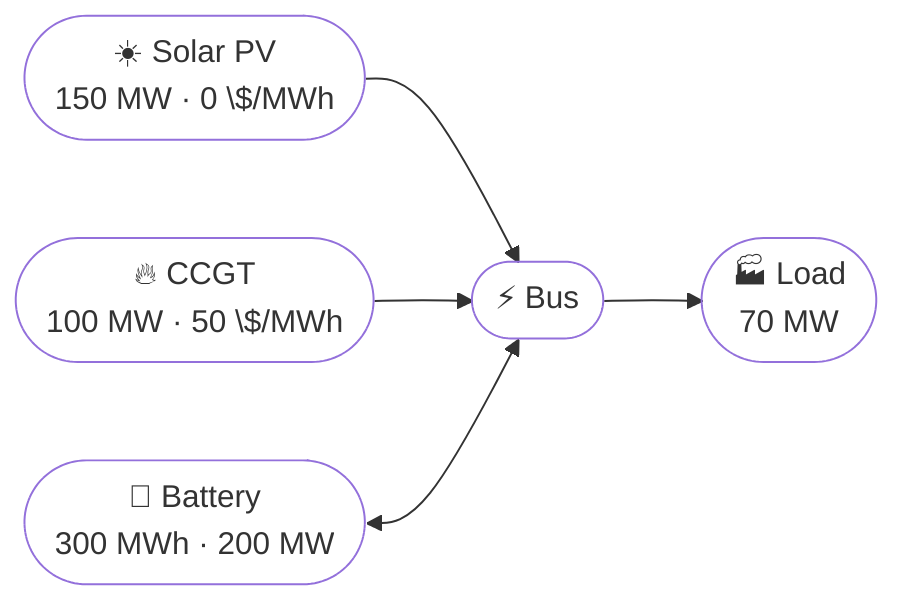

# Battery Dispatch

## Problem Description

This example extends the basic dispatch problem by adding a battery. The question is no longer just which generator should serve the load right now, but also whether some energy should be saved for later.

The system still has a fixed 70 MW load over 24 hourly periods, a free solar plant, and a gas turbine with a marginal cost of 50 $/MWh. The new element is a battery with limited energy capacity, limited power, and no initial or final energy target other than starting and ending empty.

That changes the problem in an important way: solar does not have to be used immediately. If there is excess solar in one step, the optimizer can store it and use it later when solar output falls.



**Source**: [`examples/battery_dispatch.py`](https://github.com/ramirocrc/odys/blob/main/examples/battery_dispatch.py)

## Walkthrough

### 1. Add storage to the asset list

The battery is the new ingredient. It does not create energy on its own, but it gives the optimizer a way to shift energy from one timestep to another.

```python
from datetime import timedelta

from odys import AssetPortfolio, EnergySystem, Generator, Load, LoadType, Scenario, Storage

generator_1 = Generator(name="ccgt", nominal_power=100, variable_cost=50)
generator_2 = Generator(name="solar_pv", nominal_power=150, variable_cost=0)
load = Load(name="load", type=LoadType.Fixed)
battery = Storage(name="battery", capacity=300, max_power=200, soc_start=0, soc_end=0)
portfolio = AssetPortfolio(assets=[generator_1, generator_2, load, battery])
```

The battery is what turns this into a scheduling problem. A generator can only produce when it is needed, but a battery can move energy across time.

### 2. Describe the scenario

The scenario is the same as in the basic dispatch example: the ccgt is fully
available throughout the selected period, the solar PV plant has a time-varying
maximum available capacity, and the load is fixed at 70 MW.

The only new ingredient is the battery. That means the scenario itself does not
change, but the optimizer now has an extra way to respond to the same demand
and solar profile: it can store surplus energy and use it later.

```python
scenario = Scenario(
    available_capacity_profiles={
        "ccgt": 24 * [100],
        "solar_pv": [0, 0, 0, 0, 0, 0, 10, 30, 60, 90, 110, 120, 125, 120, 110, 90, 60, 30, 10, 0, 0, 0, 0, 0],
    },
    load_profiles={"load": 24 * [70]},
)
```

This is where the battery becomes useful. When solar is above 70 MW, there is spare energy that can be stored instead of wasted. When solar falls below 70 MW, the battery can cover part of the gap.

### 3. Solve and inspect both generators and storage

```python
energy_system = EnergySystem(portfolio=portfolio, timestep=timedelta(hours=1), number_of_steps=24, scenarios=scenario)

result = energy_system.optimize()
```

At this point you want to look at the generator and battery outputs together. The interesting behavior is not just whether the battery moves energy, but when it chooses to move it.

## Results

The chart below shows how storage changes the dispatch. The top panel shows generator output and battery power flow (discharge positive, charging negative), while the bottom panel shows the battery state of charge.

<iframe src="../assets/examples/battery_dispatch.html" style="width:100%; height:1000px; border:none;" loading="lazy"></iframe>

The output should show several distinct behaviors:

- during the early morning (timesteps 0–5), solar is zero and the battery starts empty, so CCGT meets the full load
- as solar ramps up (timesteps 6–8), it covers part of the load and CCGT output falls
- during peak solar hours (timesteps 9–15), solar exceeds the load and the battery charges with the surplus (positive bars on the chart, up to 55 MW at timestep 12)
- as solar declines (timesteps 16–18), the battery discharges to supplement the remaining solar output
- in the evening (timesteps 19–23), solar drops to zero and the battery discharges to meet the load, almost entirely replacing CCGT

Because the battery starts and ends empty, the optimizer cannot treat storage as a free source of energy. It has to choose when storing energy is worth the round-trip losses. With 300 MWh of capacity, the battery can absorb most of the midday surplus and release it through the evening, dramatically reducing gas use.

## Discussion

This is a nice example of why storage matters in power systems. Without it, the system must react to each timestep in isolation. With it, the optimizer can smooth out variability and reduce gas use.

A good thing to watch here is the interaction between efficiency and timing. The battery is useful even with losses, but it is only worth charging when the later benefit is large enough to justify those losses.
