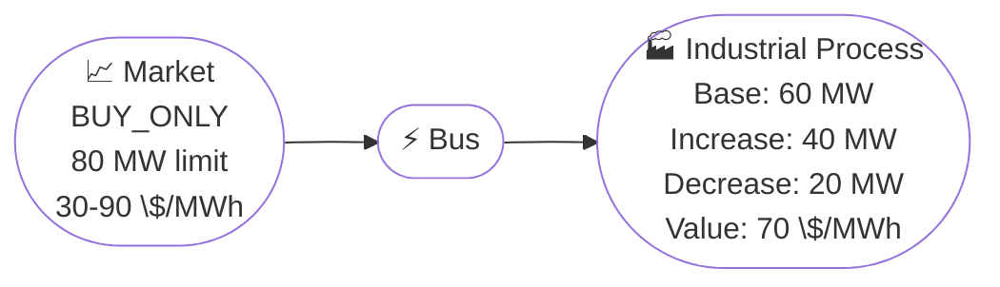

# Flexible Load Market Arbitrage

## Problem Description

This example shows how a flexible industrial consumer can shift electricity consumption to take advantage of low market prices. Instead of consuming a fixed amount regardless of cost, the optimizer adjusts demand up or down based on the economic value of consumption versus the market price.

The setup models an industrial process (like an aluminum smelter or data center) with a baseline consumption of 60 MW. The process can increase consumption by up to 40 MW or decrease by up to 20 MW. Each MWh consumed has an economic value of 70 $/MWh, representing the revenue or benefit generated by using that electricity.

The optimizer's decision logic compares the marginal value of consumption (70 $/MWh) against the marginal cost (market price):
- When market price < 70 $/MWh: value exceeds cost, so consuming more adds profit
- When market price > 70 $/MWh: cost exceeds value, so consuming less saves money
- When market price = 70 $/MWh: neutral, no adjustment

This demonstrates [demand response](../user_guide/load.md#flexible-loads): the flexibility to shift when you consume, not just how much you generate.



**Source**: [`examples/flexible_load_market.py`](https://github.com/ramirocrc/odys/blob/main/examples/flexible_load_market.py)

## Walkthrough

### 1. Define the market and flexible load

The [market](../user_guide/market.md) gives us an external source of electricity with time-varying prices. The [flexible load](../user_guide/load.md#flexible-loads) represents an industrial process that can adjust its consumption within bounds.

```python
from datetime import timedelta

from odys import AssetPortfolio, EnergyMarket, EnergySystem, FlexibleLoad, Scenario, TradeDirection

market = EnergyMarket(
    name="market",
    max_trading_volume_per_step=80,
    trade_direction=TradeDirection.BUY_ONLY,
)

industrial_process = FlexibleLoad(
    name="industrial_process",
    max_increase=40,
    max_decrease=20,
    value_of_consumption=70,
)

portfolio = AssetPortfolio(assets=[industrial_process])
```

The key parameters are `max_increase` and `max_decrease`, which define how much the load can flex around its base profile, and `value_of_consumption`, which tells the optimizer how much each MWh is worth to the process.

### 2. Tell the model the base consumption and market prices

The base load profile is the nominal consumption before any flexibility is applied. The market prices vary throughout the day, creating arbitrage opportunities.

```python
scenario = Scenario(
    flexible_load_base_profiles={
        "industrial_process": 24 * [60],
    },
    market_prices={
        "market": [80, 75, 70, 65, 60, 55, 50, 45, 40, 35, 30, 35, 40, 45, 50, 55, 60, 70, 80, 90, 85, 80, 75, 70],
    },
)
```

The base consumption is constant at 60 MW. The market prices range from 30 to 90 $/MWh, with some hours below the 70 $/MWh value of consumption and others above it.

### 3. Solve the system

```python
energy_system = EnergySystem(
    portfolio=portfolio,
    markets=market,
    timestep=timedelta(hours=1),
    number_of_steps=24,
    scenarios=scenario,
)

result = energy_system.optimize()
```

Notice how the solver decides at each timestep whether to increase, decrease, or maintain the base consumption, depending on whether the market price makes it profitable to consume more or less.

## Results

The chart below shows how the optimizer shifts consumption toward low-price hours. The upper panel displays the base load profile (dashed gray line at 60 MW) and the actual consumption after adjustment (solid blue line). The lower panel shows market prices alongside the value of consumption threshold (70 $/MWh), which drives the decision logic.

<iframe src="../assets/examples/flexible_load_market.html" style="width:100%; height:700px; border:none;" loading="lazy"></iframe>

Notice how the optimizer responds to the price signal:

- **Hours 3-16** (price 30-65 $/MWh): Price is below 70 $/MWh, so the optimizer increases load to the market limit (+20 MW). Total consumption = 80 MW.
- **Hours 0-2, 17-23** (price 70-90 $/MWh): Price is above 70 $/MWh, so the optimizer decreases load (-20 MW). Total consumption = 40 MW.
- **Hours 2, 23** (price 70 $/MWh): Price equals the value of consumption, so consumption stays at 60 MW.

You can inspect the results via:

- `result.flexible_loads.load_adjustment`: the adjustment at each timestep
- `result.flexible_loads.actual_load`: the final consumption (base + adjustment)
- `result.markets.buy_volume`: market purchases, which match actual consumption since the market is the only supply source

## Discussion

This example demonstrates demand response, a key flexibility mechanism in modern energy systems. Unlike generators that can ramp up or down, flexible loads can shift when they consume within operational bounds while maintaining the same production output.

The economic logic is simple: if consuming electricity generates more value than it costs, consume more. If it costs more than it's worth, consume less. The optimizer finds the optimal adjustment at each timestep.

Real-world applications include:
- Data centers shifting computational workloads to off-peak hours
- Aluminum smelters adjusting production rates
- Water pumping and storage systems
- Industrial processes with thermal or buffer storage

Notice that the market volume limit (80 MW) constrains how much the flexible load can increase. Even though the process could consume up to 100 MW when prices are low, the market only allows 80 MW per timestep, so the optimizer is capped at that limit during cheap hours.

## Next steps

This example used a single market as the only supply source. The [Market Arbitrage](market_arbitrage.md) example adds a generator to compare self-generation against market purchases. For uncertainty-aware optimization with flexible loads, see [CVaR Market Risk](cvar_market_risk.md).
