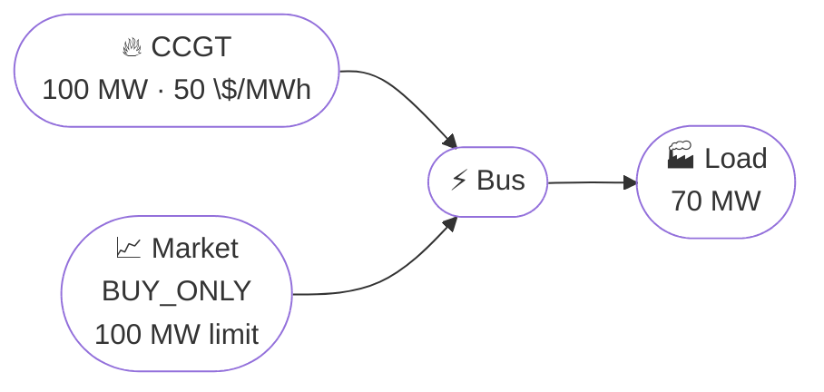

# Market Arbitrage

## Problem Description

This example adds a market to the dispatch problem. The optimizer now has two ways to satisfy demand: generate locally with a gas turbine or buy energy from a market.

The load is fixed at 70 MW over 24 hourly periods. The gas turbine has a marginal cost of 50 $/MWh, while the market price changes from step to step. Since the market is buy-only, the optimizer is deciding when to procure from the market and when local generation is cheaper.

This is useful because it introduces an external price signal. Instead of only comparing assets against one another, the model is comparing local production against a live market alternative.



**Source**: [`examples/market_arbitrage.py`](https://github.com/ramirocrc/odys/blob/main/examples/market_arbitrage.py)

## Walkthrough

### 1. Define the local supply and the market

The generator gives us a local source of electricity, and the market gives us an external fallback option.

```python
from datetime import timedelta

from odys import AssetPortfolio, EnergyMarket, EnergySystem, FixedLoad, Generator, Scenario, TradeDirection

generator_1 = Generator(name="ccgt", nominal_power=100, variable_cost=50)
load = FixedLoad(name="load")

market = EnergyMarket(
    name="market",
    max_trading_volume_per_step=100,
    trade_direction=TradeDirection.BUY_ONLY,
)
portfolio = AssetPortfolio(assets=[generator_1, load])
```

The buy-only restriction is important. It keeps the example focused on procurement decisions instead of turning it into a trading problem.

### 2. Tell the model when the market is cheap or expensive

```python
scenario = Scenario(
    available_capacity_profiles={"ccgt": 24 * [100]},
    fixed_load_profiles={"load": 24 * [70]},
    market_prices={"market": [80, 75, 70, 65, 60, 55, 50, 45, 40, 35, 30, 35, 40, 45, 50, 55, 60, 70, 80, 90, 85, 80, 75, 70]},
)
```

The price series is the whole point of the example. When the market is cheap, the optimizer should buy. When it is expensive, the generator should run instead.

### 3. Solve the system

```python
energy_system = EnergySystem(
    portfolio=portfolio, markets=market, timestep=timedelta(hours=1), number_of_steps=24, scenarios=scenario
)

result = energy_system.optimize()
```

Now the solver compares the cost of generating locally with the market price at each timestep. Nothing else changes, so the market signal is what drives the decision.

## Results

The chart below compares local generation against market purchases. The top panel shows the dispatch decision, while the bottom panel displays market prices alongside the CCGT marginal cost reference line. This layout makes it easy to see exactly when the optimizer switches between the two sources.

<iframe src="../assets/examples/market_arbitrage.html" style="width:100%; height:700px; border:none;" loading="lazy"></iframe>

The dispatch should flip around the 50 $/MWh threshold:

- when the market is cheaper than gas, the optimizer buys
- when the market is more expensive, it generates locally

The output makes this easy to spot because the market price changes over time. That means the optimal decision can change from one timestep to the next even though the load stays constant.

## Discussion

This example is the bridge between physical dispatch and market participation. It shows that the solver is not just balancing assets, but also comparing internal production against an external price.

One thing to notice is that the market volume limit still matters. Even if the market is cheap, the optimizer cannot buy more than the market allows in a single step.
